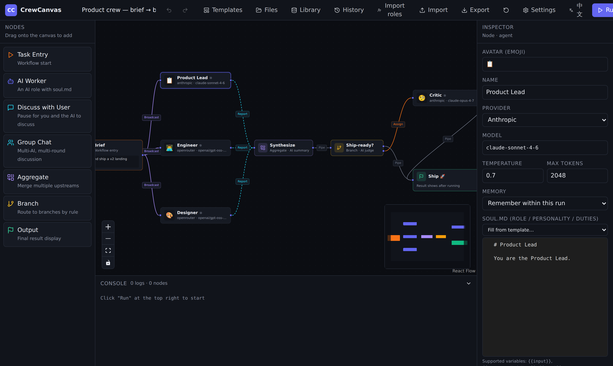

# CrewCanvas

**Drag-and-drop orchestration for teams of AIs — 100% in your browser.**

Draw an org chart on a canvas, give each AI a personality, wire the roles together, and press **Run**. No backend, no sign-up, no server-side state — your keys and data never leave your browser.

> UI is **English** by default with a **中文** toggle in the top bar. In-depth guides live in [`docs/`](./docs).

<!-- Add a screenshot or GIF at docs/screenshot.png and it renders below. A short GIF of building + running a flow works best. -->


---

## Why CrewCanvas

A single chatbot is one voice. Real work often needs several — a PM, an engineer, and a designer reacting to one brief; an optimist and a critic refereed by a moderator; a manager that splits a job and hands pieces to specialists. CrewCanvas lets you wire those roles into a graph and watch them collaborate, with full visibility into every step.

- **🧩 Visual multi-agent canvas** — 7 node types (AI Worker · Group Chat · Branch · Aggregate · …) and 6 typed edges that set the up/downstream communication semantics. Give each AI a `soul.md` persona; route the flow with regex or a real **LLM-judge**.
- **🔒 Zero backend, keys stay local** — everything runs in `localStorage` + IndexedDB and ships as static files. Requests go **browser-direct** to the provider; nothing is proxied through a server.
- **🔌 Bring your own models & tools** — 5 providers including local **Ollama** and **LM Studio**, plus a per-workflow file system, a local **RAG** library, and your own **MCP** tool servers.

## Quickstart

Install [Node.js LTS](https://nodejs.org/) first, then launch for your OS:

| System | Launcher |
|---|---|
| Windows | Double-click `run-windows.bat` |
| macOS | Double-click `run-macos.command` |
| Linux | Run `./run-linux.sh` |

The launchers install dependencies on first run, start CrewCanvas, and open the browser automatically — keep the terminal window open while using the app.

Prefer to run it by hand?

```bash
npm install
npm run dev          # opens http://127.0.0.1:5173/
```

Then: **Settings** → paste an API key (OpenRouter is an easy start) → **Test connection** → load a **Template** → fill the **Task Entry** → **Run**. New here? Start with the [User Guide](./docs/user-guide.md).

To build static assets for deployment: `npm run build` → serve `dist/` on any static host (Vercel, Cloudflare Pages, GitHub Pages, Nginx, Caddy, or over a tailnet).

## Security

API keys are stored in plaintext in your browser's `localStorage`, and every request goes directly from the browser to the model provider. **Use this only on your own device** — never on a shared or public machine. Two things run with your trust: **Import from TS** executes pasted code in the browser, and any **MCP server** you connect can do whatever its tools allow. Master-password encryption (Web Crypto · PBKDF2 · AES-GCM) is on the roadmap.

## License

[GNU General Public License v3.0](./LICENSE).

## Roadmap

- Master-password encryption for API keys
- Node search & large-graph virtualization
- Optional sync backend (multi-device)
- Cancel in-flight requests in group-chat race mode
- A real summarizing agent for the Aggregator `summarize` strategy
